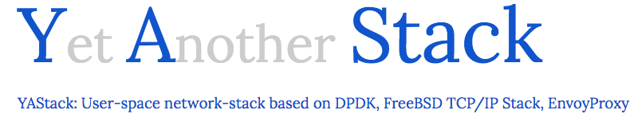

# yastack
YAStack brings the speed of [F-stack](fs/) to [envoy proxy](ev/).

Envoy's modular C++ codebase, clear separation of control plane and its filter architecture provides a way to quickly add new functionality. F-stack's freebsd stack provides the ability to perform packet processing from L2-L6. This integration provides for a high-speed L2-L7 stack for use in performance critial applications. Since the network stack resides in the user-space, it allows for quick iterations without modifying kernel code.

Envoy uses libevent to collect OS events. Libevent integration with f-stack thus provides a way for other applications that use libevent to integrate with this work. Details of libevent integration can be found under [fs/app/libevent](fs/app/libevent)

DPDK integration generally uses Receive Side Scaling (RSS) to scale flow across cores. This needs hardware support. Yastack implementation can work without RSS hardware support. The flow distribution logic is encoded in software for better control. Setting of a newly introduced flag allows for the flow distribution logic in software to take over. This also eases the development process since it removes the dependency on hardware during development.

Software versions used in this project:

```
  Envoy Proxy - 1.8.0
  DPDK        - 18.0
  F-Stack     - fs/last_commit.txt
```

Blogs and additional documentation at - [yastack.io](https://yastack.io)

[Quick Start](docs/Start-here.md)
